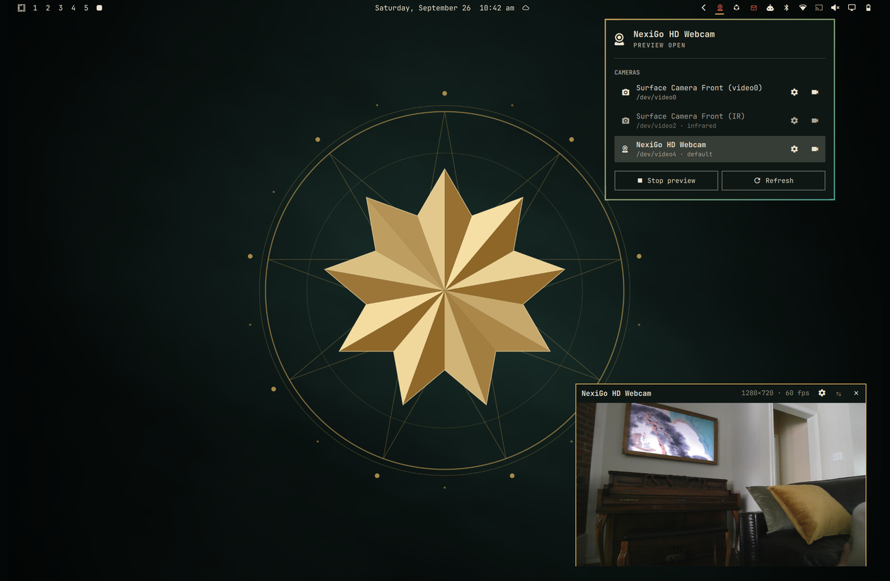
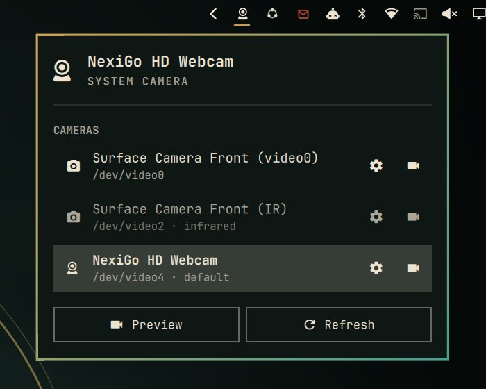
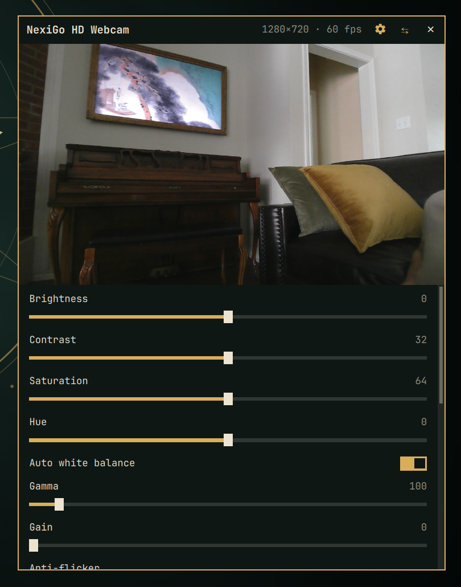

# Omarchy Webcam

**Pick which camera your Omarchy system uses, see what it sees, and tune how it looks, all from the bar.**

Most laptops have a built-in camera, and many desks add a USB webcam. This bar widget lists every camera PipeWire knows about, makes the one you pick the system camera, and opens a small live preview so you can check it before a call. From that preview you can also adjust the camera's image settings (brightness, white balance, exposure, zoom and more) and watch each change as you make it.



## What it does

### Choose the system camera



- **Lists every camera** PipeWire knows about, including USB webcams as they're plugged in. Infrared (Windows Hello-style) sensors are flagged and dimmed.
- **Sets the system camera.** Click a camera to make it PipeWire's default video source (`wpctl set-default`). WirePlumber saves this choice, so it persists after a reboot.
- **Previews any camera.** Click the video icon on a row to watch that camera, or right-click the bar icon to preview the current default. The bar icon lights up while a preview is open.

<br clear="right">

### Preview and tune the image



- **Opens a live preview window** in the bottom-right corner. It shows the camera name, resolution and frame rate. You can drag the title bar to move it, press `⇆` or `m` to mirror the image, and press `✕`, `Esc` or `q` to close it.
- **Adjusts image settings.** Click the gear on a camera's row, or in the preview's title bar. Brightness, contrast, saturation, white balance, exposure, gain, anti-flicker, pan/tilt/zoom, and anything else the camera driver offers appear as sliders, switches and choices under the video, so you see every change live.
- **Remembers them.** Changes are saved per physical camera and reapplied when it's plugged back in or after a reboot. A `•` marks settings you've changed; double-click a name to put it back, or use **Reset all**.

<br clear="right">

### Which apps respect the choice?

Apps that access cameras through PipeWire or the camera portal (Firefox, Chromium/Chrome with PipeWire camera support, OBS's PipeWire source, GNOME/KDE apps) treat the default camera as the preferred one. Apps that open `/dev/videoN` directly, such as older V4L2 tools, still choose their own device, usually through a setting inside the app.

## Install

```bash
omarchy plugin add https://github.com/ninepointlabs/omarchy-webcam.git --enable
```

For development, symlink a checkout instead:

```bash
ln -sfn ~/Projects/omarchy-webcam ~/.config/omarchy/plugins/ninepointlabs.webcam
omarchy-shell shell rescanPlugins
omarchy plugin enable ninepointlabs.webcam
```

Requirements: PipeWire + WirePlumber (`pw-dump`, `wpctl`), `jq`, `v4l-utils` (`v4l2-ctl`, for image settings and IR detection), and `qt6-multimedia` with the FFmpeg backend for the preview. All of these ship with Omarchy.

> **Developing through a symlink:** the shell watches `~/.config/omarchy/plugins/` with `inotifywait`, which doesn't follow symlinks, so edits in your checkout don't hot-reload. The preview window reloads every time it opens. To load `Webcam.qml` changes, run `omarchy restart shell`.

## Using it

| Action | How |
| --- | --- |
| Open the camera picker | Click the bar icon |
| Make a camera the default | Click its row (or use arrow keys / `j` `k` and `Enter`) |
| Preview a specific camera | Click the video icon on its row, or highlight it and press `p` |
| Preview or stop the default camera | Right-click the bar icon, or use the **Preview** button |
| Adjust a camera's image settings | Click the gear on its row, or highlight it and press `a` |
| Show/hide settings under a preview | Gear in the preview's title bar, or `c` |
| Reset one setting | Double-click its name (a `•` marks changed settings) |
| Reset every setting | **Reset all** at the bottom of the settings |
| Stop the preview | `s` in the popup, `✕` / `Esc` in the preview window |

### Keybinding / scripting

```bash
omarchy-shell ninepointlabs.webcam toggle        # open/close the picker
omarchy-shell ninepointlabs.webcam preview       # preview the current default camera
omarchy-shell ninepointlabs.webcam settings      # preview + image settings for the default camera
omarchy-shell ninepointlabs.webcam stopPreview

# The helper works on its own, too:
bin/webcamctl list                 # JSON camera list
bin/webcamctl set-default 88       # PipeWire node id from `list`
bin/webcamctl toggle-preview       # handy for a Hyprland keybinding
bin/webcamctl controls /dev/video4 # JSON list of image controls
bin/webcamctl set-controls /dev/video4 brightness=10 white_balance_automatic=0
bin/webcamctl reset-controls /dev/video4
bin/webcamctl restore              # reapply saved settings to every camera
```

### Image settings details

- Only the controls that the camera's driver exposes are shown, so every camera has a different set. Settings the driver has locked are dimmed. For example, **White balance** is locked while **Auto white balance** is on, and **Exposure time** is locked while **Exposure mode** is Auto.
- Settings are saved in `~/.local/state/omarchy-webcam/controls/`, one file per camera. Each file is named after the camera's udev by-id link (vendor, model and serial), so a camera keeps its settings when you move it to a different USB port. Only values that differ from the driver defaults are saved.
- The bar widget reapplies saved settings when the shell starts and whenever a camera appears. It checks every 10 seconds, so after you replug a camera its settings may take a few seconds to come back.
- These are hardware settings, so they apply to every app that uses the camera, not just the preview.

## Settings

These go on the widget's entry in `~/.config/omarchy/shell.json`:

| Key | Default | Meaning |
| --- | --- | --- |
| `previewWidth` | `480` | Width of the preview window in logical pixels (240–1280) |
| `showIr` | `true` | Include infrared sensors in the list |

## How it's built

- `Webcam.qml`: the bar icon and popup. It never parses devices on its own; it only renders the JSON that `webcamctl list` returns.
- `bin/webcamctl`: reads image controls with `v4l2-ctl`, applies auto-mode switches before the manual values they unlock, and saves changes per camera. It also reads the camera list from `pw-dump`, validates every node id and device path, switches the default with `wpctl`, and manages a single preview process. It keeps a pid file under `$XDG_RUNTIME_DIR` and checks the process's identity before sending it a signal.
- `preview/shell.qml`: a standalone Quickshell layer-shell window that uses QtMultimedia. It runs as a **separate process**, so a stuck or crashing camera driver cannot take down the Omarchy shell and bar.

## Tests

```bash
test/webcamctl.test.sh
```

Runs the helper against a recorded `pw-dump` fixture, a fake `wpctl`, and a fake `v4l2-ctl` that mimics how the driver locks manual controls while auto modes are on. It does not need real cameras.

## License

MIT. See [LICENSE](LICENSE).
